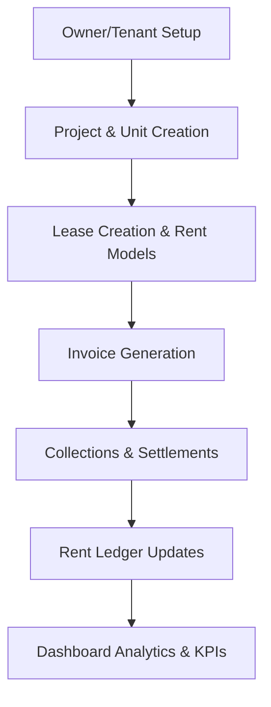

# DMAICPRO – Property & Lease Management ERP

DMAICPRO is a multi-tenant SaaS-based Property & Lease Management ERP system designed for malls, commercial buildings, and real estate companies. The platform helps manage projects, units, leases, invoicing, collections, tenants, owners, and financial reporting from a centralized, real-time dashboard.

## 🚀 Features

- **Multi-Tenant SaaS Architecture:** Complete data isolation and branding per company.
- **Property & Unit Management:** Track units, chargeable areas, and ownership status.
- **Lease Management:** Handle Fixed Rent, Minimum Guarantee (MG), and Revenue Share models.
- **Rent Invoicing:** Automated generation of complex multi-unit invoices with GST mapping.
- **Collections & Settlement:** Track payments, calculate TDS adjustments, and reconcile balances.
- **Rent Ledger:** Deep-dive financial statements for tenants and collection efficiency reports for owners.
- **Dashboard Analytics:** Real-time KPI analytics, collection trends, and debtors aging analysis.
- **Secure Authentication:** Supabase RBAC with Row-Level Security (RLS).

## 🏢 Modules

### 1. Dashboard
- Real-time KPI analytics & collection trends
- Debtors aging reports (0-30d, 31-60d, 61-90d+)
- Lease expiry alerts & uninvoiced unit tracking

### 2. Master Data
- **Projects:** Centralized property details
- **Units:** Floor-wise mapping, zoning, and status tracking
- **Owners & Tenants:** Party profiles, bank details, and compliance data

### 3. Lease Management
- Dynamic rent models: Fixed, Revenue Share, MG + Revenue Share
- Rent commencement dates, lock-in periods, and auto-escalations

### 4. Invoicing
- One-click invoice generation for all active units
- Consolidated invoices with itemized rent, CAM, and GST calculations

### 5. Collections
- Payment settlement engine with partial payment support
- TDS adjustment and automatic outstanding balance recalculation

### 6. Rent Ledger
- Historical tenant statements
- Owner reports for collection efficiency

## 💻 Tech Stack

### Frontend
- **Framework:** React.js + Vite
- **Language:** JavaScript / JSX
- **Styling:** Tailwind CSS v4

### Backend & Database
- **Database:** PostgreSQL
- **BaaS:** Supabase (Auth, Database, Storage)
- **Security:** Row Level Security (RLS) & JWT Authentication

### Hosting
- **Frontend:** Netlify / Vercel
- **Backend:** Supabase Edge

## 🏗️ Architecture

- **Multi-Tenant SaaS System:** Ensures strict isolation of company data.
- **Row-Level Security (RLS):** Policies enforce that users only interact with authorized data.
- **Centralized Financial Engine:** A single source of truth linking Leases -> Invoices -> Collections -> Ledgers.
- **Role-Based Access Control:** Differentiated access for Super Admins and Company Users.

## 🔄 Business Workflow



## ⚙️ Installation

### 1. Clone the Repository
```bash
git clone https://github.com/prenayasofttech/Invoicing.git
cd Invoicing/leaseos-invoicing
```

### 2. Install Dependencies
```bash
npm install --legacy-peer-deps
```

### 3. Start Development Server
```bash
npm run dev
```

## 🔐 Environment Variables

Create a `.env` file in the `leaseos-invoicing` directory:

```env
VITE_SUPABASE_URL=your-supabase-url
VITE_SUPABASE_ANON_KEY=your-supabase-anon-key
```

## 🗄️ Database Setup

- The application uses **PostgreSQL**.
- Schema includes multi-tenant support through the `company_users` table.
- RLS policies must be enabled to prevent cross-tenant data leakage.

## 📸 Screenshots

*(Add screenshots to the `/screenshots/` directory)*

- **Dashboard:** ``
- **Invoicing Module:** ``
- **Collections & Ledger:** ``

## 🚀 Deployment

- **Frontend:** Optimized for Vercel & Netlify (`npm run build`).
- **Backend:** Supabase handles database scaling and authentication natively.

## 🛡️ Security

- **Row Level Security (RLS):** Hardened data isolation.
- **Tenant Isolation:** Queries automatically filter by `company_id`.
- **JWT Authentication:** Secure API access via Supabase Auth.
- **Immutable Financial Transactions:** Prevent accidental deletion of settled invoices.

## 🤝 Contributors

- **Sanket Gaikwad**
- **Prenaya Softtech**

## 🔮 Future Enhancements

- WhatsApp Integration for invoice sharing
- Auto Bank Reconciliation
- Integrated Payment Gateways
- AI-Driven Predictive Analytics
- Dedicated Mobile Application
